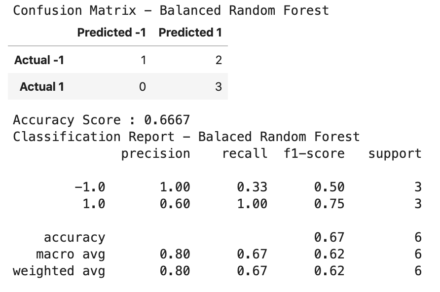
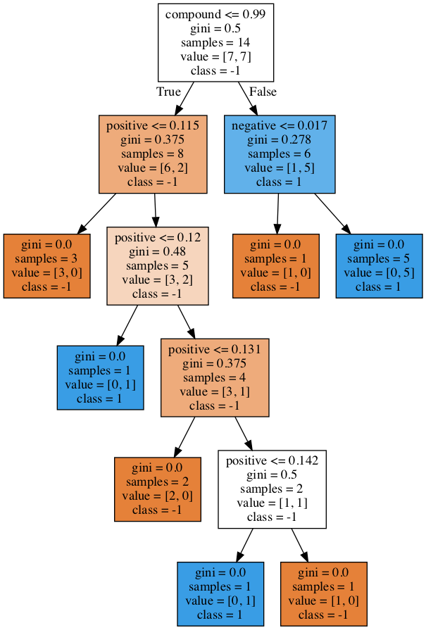
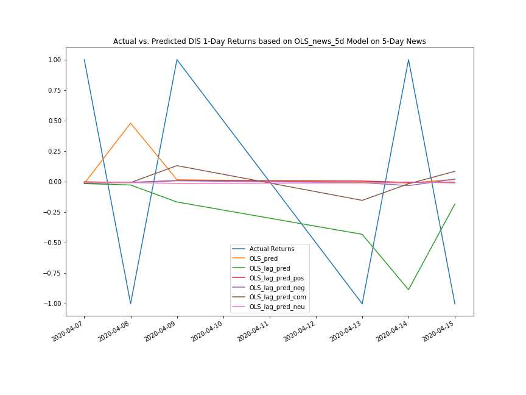
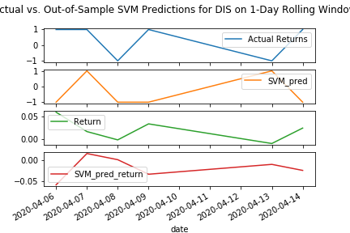

## Models of Good Fit
_**Based on 31 days of data: 3/15/2020 to 4/15/2020**_
_Note: Changes on test statistics based on live data may lead to different choice of models._

_**a. Logit Regression**_
* The `balanced accuracy score` is 0.83.

<details><summary>
Evaluation (click me)
</summary>


</details>

<details><summary>
Code (click me)
</summary>

```python
# ********* MODEL FITTING *************
   # --------- Loigt -----------
   # --------Start-------------
   
M = 'Logit'
from sklearn import linear_model 
lm = linear_model.LogisticRegression(C = 1e5)
lm.fit(X_train, y_train)
lm_pred = lm.predict(X_test)


  # --------- Logit ------------
   # ---------End -------------

```
</details>


_**b. Balanced Random Forest Classifier Ensemble Learning**_
* The `balanced accuracy score` is 0.67.
* Better choice over Decision Tree model as it prevents _**overfitting**_
<details><summary>
Evaluation
</summary>



</details>

<details><summary>
Code
</summary>

```python

# ********* MODEL FITTING *************
   # -----Balanced Random Forest -------
   # --------Start-------------

# Resample the training data with the RandomOversampler
# fit Random Forest Classifier
from imblearn.ensemble import BalancedRandomForestClassifier
brf = BalancedRandomForestClassifier(n_estimators=100, random_state=42)
brf.fit(X_train, y_train)
brf_pred = brf.predict(X_test)

   # --- Balanced Random Forest --------
   # --------End-------------

```
</details>


_**c. Decision Tree Resampling**_
* The `balanced accuracy score` is 0.67.

<details><summary>
Evaluation
</summary>


</details>

<details><summary>
Code
</summary>

```python

# ********* MODEL FITTING *************
   # ----- Decision Tree -------
   # --------Start-------------

from sklearn import tree
# Needed for decision tree visualization
import pydotplus
from IPython.display import Image

# Creating the decision tree classifier instance
model_tree = tree.DecisionTreeClassifier()
# Fitting the model
model_tree = model_tree.fit(X_train, y_train)
# Making predictions using the testing data
tree_pred = model_tree.predict(X_test)

  # --- Decision Tree --------
   # --------End-------------

```

</details>





#### Data Preparation for Models

<details><summary>
Code 
</summary>

```python

# Creating training and testing data sets
from sklearn.model_selection import train_test_split
X_train, X_test, y_train, y_test = train_test_split(X, y, test_size = 0.3, shuffle=False, random_state=42) 

# For neural network sequential, LSTM and ensemble learning
#Create the StandardScaler instance
scaler = StandardScaler()
# Fit the Standard Scaler with the training data
X_scaler = scaler.fit(X_train)

# Scale the training data - only scale X_train and X_test data 
X_train_scaled = X_scaler.transform(X_train)
X_test_scaled = X_scaler.transform(X_test)


# Creating validation data sets for deep learning on neural network model training
from sklearn.model_selection import train_test_split
X_train, X_val, y_train, y_val = train_test_split(X_train, y_train, test_size = 0.3, shuffle=False) 


```
</details>

#### Model Evaluation

* Confusion Matrix and Balanced Accuracy Scores for Logit, Supervised Resampling and Ensemble Learning

<details><summary>
Code
</summary>


```python
# Score the accuracy
print("Training vs. Testing - Logit")
print(f"Training Data Score: {lm.score(X_train, y_train):,.04f}")
print(f"Testing Data Score: {lm.score(X_test, y_test):,.04f}")

# Evaluating the Logit model in a nicer format
# Calculating the confusion matrix
cm_lm = confusion_matrix(y_test, lm_pred)
cm_lm_df = pd.DataFrame(
    cm_lm, index=["Actual -1", "Actual 1"], columns=["Predicted -1", "Predicted 1"]
)
# Calculating the accuracy score
acc_lm_score = balanced_accuracy_score(y_test, lm_pred)

# Displaying results
print("Confusion Matrix - Logit")
display(cm_lm_df)
print(f"Balanced Accuracy Score : {acc_lm_score:,.04f}")
print("Classification Report - Logit")
print(classification_report(y_test, lm_pred))

```
</details>


## **Discussions** 

### **Impact of Positive vs. Negative News Sentiments**

_**Conclusion:** Predictions are more consistent with actual directions of price moves on negative compared to positive sentiments, subject to overfitting._

**Deep Learning LSTM Model**

_**Positive News Sentiments**_


_**Negative News Sentiments**_


_Note: Potentially overfitting. Needed more data._

_**OLS Prediction on Price Move Directions due to News Sentiments in the Past 5 Days**_


_**OLS Predicted Returns on News Sentiments in the Past 5 Days**_

_Note: Inverted due to complications when multiplying positive and negative signs._

### _**Snoozed Sentiments? For How Long?**_
_Impact on Lagged Response to News Sentiments_

##### **OLS with Rolling One-day Training Window**


##### **OLS with Rolling Three-day Training Window**


##### **OLS with Rolling Five-day Training Window**


_**Other Discussions**_

##### **Gradient Boosting Ensemble Learning on News Sentiments**


##### **Returns from predicted directions: does multiplication always work?**




#### _Interpretation on Test Statistics_

> _**Confusion Matrix**_
> |                   | Predicted 0 (-1) | Predicted 1  |
> |-------------------|------------------|------------- |
> |  Actually 0 (-1)  |      TN          |     FP       |
> |  Actually 1       |      FN          |     TP       |

* **Accuracy = (TP+TN)/(TP+TN+FP+FN)** 
    * It is biased in this case as it treats FP and FN equally and out data if highly imbalanced with more weights on true negatives (TN) for loans of low risks. 
    * Therefore, other test statistics need to be considered

* **Precision = TP/(TP+FP)**
    * Out of all the "high-risk" predictions for loan statuses, how many are actually at "high risk".
    * It focuses on the "high-risk" data that there are significantly less observations and uses figuress in the second column of the confusion matrix.

* **Recall = TP/(TP+FN)**
    * How many actual "high-risk" loans are predicted correctly?
    * It features the second row of the confusion matrix that is consisted of the light-weighted data for high-risk loans
    * Recall is also the _**sensitivity**_ of the testing model

* **Specificity = TN/(TN+FP)**
    * How many of the actuall low-risk loan statuses are predicted correctly?
    * It spotlight the first row of our confusion matrix and examine only the more weighted negative observations in our data.

* **F1 = 2 x (Precision x Recall)/(Precision + Recall)**
    * F1 score is the harmonic mean of precision and recall.
    * As precission and recall usually go in opposite directions, f1 score is a good balance between the two.
    * F1 leverages the second row and column for actual and predicted "high risk" loan statuses.


# References

* CU Gitlab Repository
* https://machinelearningmastery.com/learning-curves-for-diagnosing-machine-learning-model-performance/
* https://stackoverflow.com/questions/46040656/binary-keras-lstm-model-does-not-output-binary-predictions
* https://pandas.pydata.org/pandas-docs/stable/reference/api/pandas.get_dummies.html
* https://medium.com/@deallen7/managing-date-datetime-and-timestamp-in-python-pandas-cc9d285302ab
* https://stackoverflow.com/questions/38067704/how-to-change-the-datetime-format-in-pandas
* https://pandas.pydata.org/pandas-docs/stable/reference/api/pandas.Timestamp.html
* "Stock Market Prediction" by The Python Quants from ML Elective for CQF
* https://imbalanced-learn.readthedocs.io
* https://scikit-learn.org/stable/
* https://towardsdatascience.com/adaboost-for-dummies-breaking-down-the-math-and-its-equations-into-simple-terms-87f439757dcf
* https://pandas.pydata.org/pandas-docs/version/0.23.4/generated/pandas.get_dummies.html
* https://www.geeksforgeeks.org/python-pandas-series/
* https://machinelearningmastery.com/random-oversampling-and-undersampling-for-imbalanced-classification/
* https://machinelearningmastery.com/combine-oversampling-and-undersampling-for-imbalanced-classification/
* https://machinelearningmastery.com/roc-curves-and-precision-recall-curves-for-classification-in-python/
* https://towardsdatascience.com/decision-trees-and-random-forests-df0c3123f991
* https://docs.scipy.org/doc/numpy/reference/generated/numpy.ravel.html#numpy.ravel
* https://www.scikit-yb.org/en/latest/api/classifier/classification_report.html